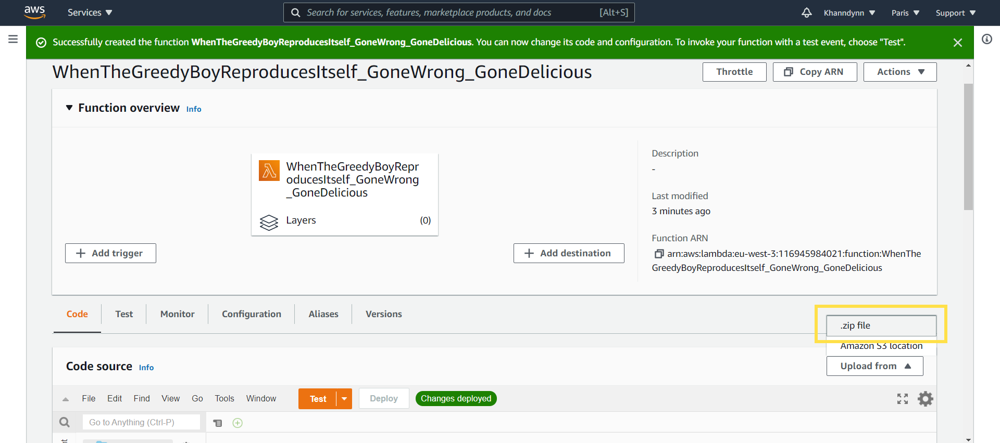
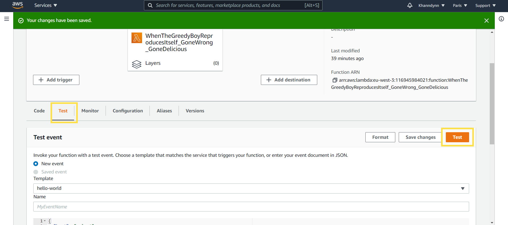

**************************************
Installation |:building_construction:|
**************************************

===================
Softwares/Libraries
===================

You will at least need Python 3.7 to launch the Zipper to export GreedyBoy into AWS Lambda.

The rest is needed if you want to modify the code or make the documentation.

+--------------+-------------------------------------------------------------+
| Software     | Link / Command                                              |
+==============+=============================================================+
| Python 3.7   | https://www.python.org/downloads/release/python-370/        |
+--------------+-------------------------------------------------------------+
| numpy        | ``pip install numpy``                                       |
+--------------+-------------------------------------------------------------+
| mpl_finance  | ``pip install mpl_finance``                                 |
+--------------+-------------------------------------------------------------+
| mplcursors   | ``pip install mplcursors``                                  |
+--------------+-------------------------------------------------------------+
| pandas       | ``pip install pandas``                                      |
+--------------+-------------------------------------------------------------+
| sphinx       | ``pip install sphinx``                                      |
+--------------+-------------------------------------------------------------+
| sphinx theme | https://bashtage.github.io/sphinx-material/#getting-started |
+--------------+-------------------------------------------------------------+
| rinohtype    | ``pip install rinohtype``                                   |
+--------------+-------------------------------------------------------------+
| sphinxemoji  | ``pip install sphinxemoji``                                 |
+--------------+-------------------------------------------------------------+

============
 AWS Lambda
============

1. Create an account on `Amazon Web Services <https://signin.aws.amazon.com/signin?redirect_uri=https%3A%2F%2Fconsole.aws.amazon.com%2Fconsole%2Fhome%3Fstate%3DhashArgs%2523%26isauthcode%3Dtrue&client_id=arn%3Aaws%3Aiam%3A%3A015428540659%3Auser%2Fhomepage&forceMobileApp=0&code_challenge=m7wzKrnU8hLURRt6uphy1wVuC7JvjkF0DvQoF8APjwI&code_challenge_method=SHA-256>`_
2. Once you've created an account, search for **AWS Lambda** and go on it.

.. image:: _static/installation/screenshot1.png
    :alt: Type ``Lambda`` in the **Search bar** and click on **Lambda**

3. Then **Create a function**.

.. image:: _static/installation/screenshot2.png
    :alt: Click on **Create function**

4. Chose **Author from scratch**, pick **Python 3.7** and click on **Create function**.

.. image:: _static/installation/screenshot3.png
    :alt: Click on **Author from scratch**, pick **Python 3.7** in the **Runtime list** and click on **Create function**

.. warning::
   First you must :ref:`Configure <configuration>` your good ol' GreedyBoy |:tools:| to continue with the next steps.

   Then after the :ref:`Configuration <configuration>`, you'll have to zip your GreedyBoy
   by launching into your GreedyBoy repository, ``make zip`` to perform the following steps.

   Or else nothing will really happen as GreedyBoy doesn't know on which
   accounts he's relied to.

5. Upload the archive of your GreedyBoy (``deploy.zip``) to your **Lambda** function.

.. image:: _static/installation/screenshot5.png
    :alt: Click on **Upload** and search for your ``deploy.zip``

6. Then configure your **Lambda** function to set the **Timeout** to **15min (AWS Lambda maximum Timeout)**.

.. note::
   We need to do that in order for GreedyBoy to stay active as long as possible.

.. image:: _static/installation/screenshot6.png
    :alt: Click on **Configuration** and **Edit**

.. image:: _static/installation/screenshot7.png
    :alt: Set **Timeout** to **15min**

**Test Result**
+++++++++++++++

.. image:: _static/installation/screenshot9.png
    :alt: GreedyBoy do be **fresh** though |:flushed:|

If there's no error, then your GreedyBoy is good to go ! |:partying_face:|